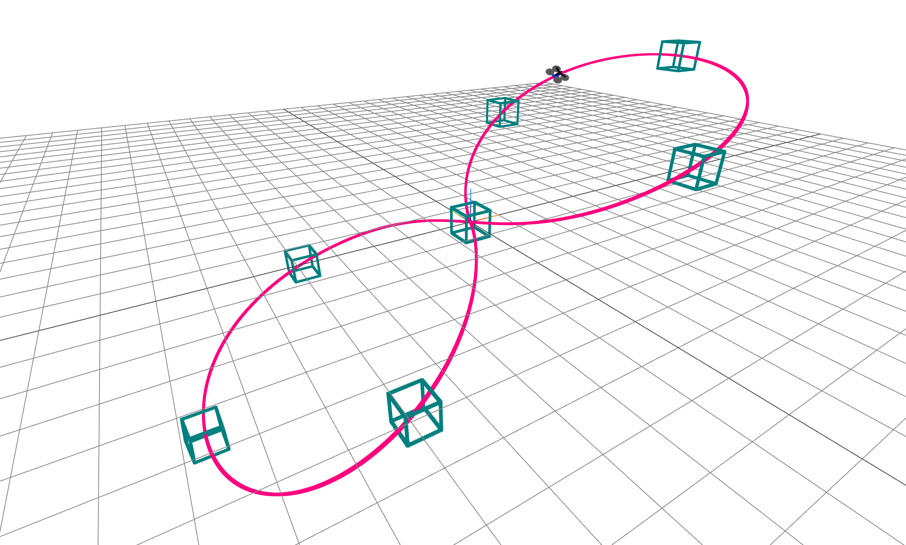

# Quadrotor Trajectory Optimization

**MIT 6.8210 Underactuated Project**



This project is an implementation of minimum snap quadrotor trajectory optimization. It is largely based off the trajectory optimization and controller described in the work of [Mellinger and Kumar](https://ieeexplore.ieee.org/abstract/document/5980409). This project uses [Drake](https://drake.mit.edu/) as a simulation environment.

# Installation

This project uses `setup.py`. After cloning this repo, cd into the repo and run:

```
pip install .
```

# Demos

See the [demos](./demos/) direction for Jupyter Notebook demos of the code.